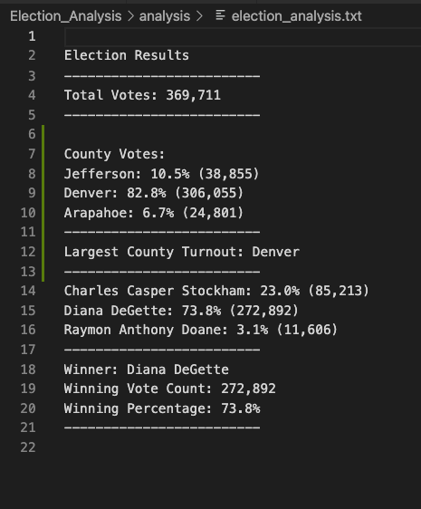

# Election Analysis
## Overview

The purpose of the election audit was to confirm the winner based on popular vote. To achieve a sucessful audit I had to :
- Caluclate how many votes were cast in the congressiona election.
- Breakdown the votes and percentages of total votes for each county in the precint.
- Calculate which county had the largest number of votes.
- Breakdown the votes and percetages of the total votes each candidate received.
- Calculate the winner of the election, what their vote count was, and what their percentage of total votes was.

## Summary

The results of the analysis showed:

- The election had a total of 369,711 votes cast.
- Each county's total votes and percentade per precint:
   - Jefferson precint received 38,855 votes, 10.5% of the total votes.
   - Denver precint received 306,055 votes, 82.8% of the total votes
   - Arapahoe precint received 24,801 votes, 6.7% of the total votes. 

- County with the largest number of votes.
    - Denver had a total of 306,055 votes and that was good for 82.8% of the total votes.

- Breakdown of the total number of votes and percentage received per candidate.
    - Charles Casper Stockham received a total of 85,213 votes, 23% of the total vote.
    - Diana DeGette received a total of 272,892 votes, 73.8% of the total vote.
    - Raymond Anthony Doane received a total of 11,606 votes, 3.1% of the total vote. 
    
- Winning Candidate

Based on popular vote the winner of the election was Diana DeGette with a total of 272,892 votes cast good for 73.8% of the total vote.

 

## Election Audit Summary

The script that was created can be modified to be used for any election by making a few changes to the way we add the files to load. If we change the script to read input() to replace the original syntax of open(). By making this change it will yield an output on terminal what the location for the file is. This will allow 

python language with Visual studio code
